<div align="center">

# GEARGRID

### Premium PC Hardware & Custom Builds — Engineered for Zero Compromises

A production-inspired MERN e-commerce platform for PC components, laptops, and custom builds — capped by **GearGrid Configure**, a server-side recommendation engine that turns a short questionnaire into three fully compatible, budget-optimized system builds pulled live from MongoDB.

[**Live Demo**](https://geargrid-delta.vercel.app/) · [**Repository**](https://github.com/AadityaHaswani/GearGrid) · [Features](#features) · [GearGrid Configure](#gear-grid-configure) · [API Docs](#api-documentation) · [Installation](#installation)

</div>

<br/>

<p align="center">
  
</p>

---

## Table of Contents

- [Project Overview](#project-overview)
- [Why GearGrid](#why-geargrid)
- [Key Highlights](#key-highlights)
- [Features](#features)
- [Technology Stack](#technology-stack)
- [System Architecture](#system-architecture)
- [Frontend Architecture](#frontend-architecture)
- [Backend Architecture](#backend-architecture)
- [Database Architecture / Models](#database-architecture--models)
- [Authentication & Security](#authentication--security)
- [JWT Authentication Flow](#jwt-authentication-flow)
- [OTP Verification Architecture](#otp-verification-architecture)
- [Resend Email Architecture](#resend-email-architecture)
- [Multer + Cloudinary Image Pipeline](#multer--cloudinary-image-pipeline)
- [Product / PC Shop Architecture](#product--pc-shop-architecture)
- [Laptop Catalog](#laptop-catalog)
- [PC Builder](#pc-builder)
- [GearGrid Configure](#gear-grid-configure)
- [Configure: Technical Flow](#configure-technical-flow)
- [Cart, Wishlist, Checkout & Orders](#cart-wishlist-checkout--orders)
- [User Profile](#user-profile)
- [Admin Console & CRUD](#admin-console--crud)
- [Search, Filtering, Sorting & Pagination](#search-filtering-sorting--pagination)
- [Responsive Design](#responsive-design)
- [SEO, Custom 404 & Web Quality](#seo-custom-404--web-quality)
- [API Documentation](#api-documentation)
- [Project Structure](#project-structure)
- [Environment Variables](#environment-variables)
- [Installation](#installation)
- [Running Locally](#running-locally)
- [Deployment](#deployment)
- [Production Configuration](#production-configuration)
- [Challenges & Solutions](#challenges--solutions)
- [Engineering Decisions](#engineering-decisions)
- [Testing](#testing)
- [Screenshots](#screenshots)
- [Future Scope](#future-scope)
- [Learning Outcomes](#learning-outcomes)
- [Team / Contributors](#team--contributors)
- [License](#license)

---

## Project Overview

GearGrid is a full-stack MERN application built around a single premise: buying PC hardware shouldn't require you to already be a PC hardware expert. It combines a conventional e-commerce storefront — product catalog, cart, wishlist, checkout, orders, admin console — with **GearGrid Configure**, a guided recommendation engine that reads a short intent questionnaire and returns three complete, compatibility-checked system builds sourced directly from the live product catalog in MongoDB.

The platform sells two categories of hardware: **desktop components** (CPUs, GPUs, motherboards, RAM, storage, cooling, cases, PSUs) and **laptops**, distinguished throughout the schema by a `productType` field (`"desktop" | "laptop"`).

## Why GearGrid

Most PC-building tools fall into one of two camps: a bare parts list with no guidance, or a "quiz" that recommends a single pre-built SKU with no transparency into *why*. GearGrid Configure sits between the two — it doesn't just say "buy this GPU," it assembles an entire eight-component system, checks every physical and electrical compatibility constraint between those parts, and explains the trade-offs of three distinct builds so the buyer can make an informed call between value, balance, and headroom.

## Key Highlights

- **GearGrid Configure** — a deterministic recommendation engine that scores real MongoDB inventory against workload weightings and returns three ranked, compatibility-verified builds (Value / Target / Performance Flex) for both desktops and laptops.
- **Two-mode building experience** — manual **PC Builder** for hobbyists who want full control, and guided **Configure** for buyers who want expert-level output from a five-question form.
- **Full authentication lifecycle** — registration, 6-digit OTP email verification, login, JWT access/refresh token rotation, forgot/reset password via OTP, and authenticated profile management.
- **Admin operations console** — full product and category CRUD with Cloudinary-backed image uploads, gated behind role-based middleware.
- **Cart, wishlist, and order pipeline** — server-persisted per-user cart and wishlist, atomic order placement from cart contents, and order history retrieval.
- **Production-grade request hygiene** — `express-validator` on every mutating route, a centralized error handler that normalizes Mongoose, Multer, and cast errors into a consistent JSON error shape.

## Features

**Storefront**
- Component shop and dedicated laptop shop, both backed by the same `Product` collection filtered on `productType`
- Product detail pages with full specification breakdowns
- Search, category, brand, price-range, and "featured" filtering with server-side pagination
- Wishlist and cart, both persisted per authenticated user in MongoDB

**Building Tools**
- **PC Builder** — manual, component-by-component system assembly
- **GearGrid Configure** — questionnaire-driven, three-build recommendation engine (desktop and laptop modes)

**Account & Orders**
- Register → OTP-verify → login flow with resend cooldown
- Forgot/reset password via a second, independent OTP flow
- Editable profile (name, phone, address, city, state, postal code, country) with Cloudinary avatar upload
- Order placement from cart, order history, and per-order detail lookup
- Payment record creation (UPI / CARD / NET_BANKING) tied to an order

**Admin**
- Role-gated admin console (`role: "admin"` on the `User` model)
- Product CRUD with image upload (create, update, delete) and category creation
- Centralized `isAdmin` middleware enforced at the route level

---

## Technology Stack

### Frontend
| Layer | Technology |
|---|---|
| UI Library | React 19 |
| Build Tool | Vite 8 |
| Routing | React Router DOM v7 |
| Global State | React Context API (`ShopContext`) with hooks — no Redux |
| HTTP Client | Axios (with request/response interceptors) |
| Animation | GSAP + `@gsap/react` |
| 3D / Visual | `@react-three/fiber`, `@react-three/drei`, `three.js` |
| Icons | `lucide-react` |
| Styling | Hand-written CSS per page/component (no Tailwind/CSS framework) |

### Backend
| Layer | Technology |
|---|---|
| Runtime | Node.js |
| Framework | Express 5 |
| Database | MongoDB with Mongoose 9 (ODM) |
| Authentication | `jsonwebtoken` (access + refresh tokens), `bcrypt` for password hashing |
| Validation | `express-validator` |
| File Uploads | `multer` (disk storage → temp) |
| Media Hosting | `cloudinary` |
| Transactional Email | `resend` |
| Utilities | `cookie-parser`, `cors`, `dotenv`, `slugify` |
| Dev Tooling | `nodemon` |

### Deployment
- **Frontend** — deployed on **Vercel** as a Vite SPA, with an `index.html` rewrite rule for client-side routing
- **Backend** — a standalone Node/Express API, deployable to any Node-compatible host (the project targets **Render**), reading configuration entirely from environment variables

---

## System Architecture

GearGrid follows a conventional decoupled MERN architecture: a Vite-built React SPA communicates with a stateless Express REST API over `/api/v1/*`, authenticated via HTTP-only JWT cookies (with a `Bearer` header fallback), backed by a single MongoDB database.

```
┌──────────────────────┐        HTTPS / REST         ┌───────────────────────┐
│   React 19 + Vite     │ ───────────────────────────▶ │   Express 5 API        │
│   (Vercel, SPA)        │ ◀─────────────────────────── │   /api/v1/*             │
│   ShopContext (state)  │      JSON + httpOnly cookies │   Node.js runtime       │
└──────────────────────┘                              └───────────┬───────────┘
                                                                    │ Mongoose
                                                                    ▼
                                                         ┌───────────────────────┐
                                                         │      MongoDB           │
                                                         │  Users · Products      │
                                                         │  Categories · Carts    │
                                                         │  Wishlists · Orders     │
                                                         │  Payments               │
                                                         └───────────────────────┘
                        External Services
        ┌────────────────────┬──────────────────────┐
        │      Cloudinary     │        Resend         │
        │  (image hosting)    │  (transactional email) │
        └────────────────────┴──────────────────────┘
```

---

## Frontend Architecture

The frontend is a single-page React application bootstrapped with Vite. Routing is centralized in `App.jsx` using React Router v7:

- **Full-bleed routes** (`/login`, `/register`) render without the shared navbar/footer.
- **`/admin`** is wrapped in an `AdminRoute` guard.
- Everything else is nested under a shared `MainLayout` (persistent navbar + footer), including `/`, `/shop`, `/laptops`, `/product/:id`, `/build`, `/pc-builder`, `/configure`, `/about`, `/cart`, `/wishlist`, `/checkout`, and a guarded `/profile` behind `ProtectedRoute`.
- An `IntroGate` component wraps the whole route tree (used for the landing intro sequence), and `ScrollToTop` resets scroll position on navigation.

**State management** is handled entirely through a single `ShopContext` (React Context + hooks — `useState`/`useEffect`/`useCallback`), covering the authenticated user, cart, wishlist, and UI state (cart/wishlist/search/auth drawers, toast notifications). There is no Redux or external state library.

**API access** is centralized in `src/services/`, one file per resource (`api.js`, `cart.api.js`, `configure.api.js`, `order.api.js`, `payment.api.js`, `product.api.js`, `wishlist.api.js`, `category.api.js`), all built on a single shared Axios instance (`api.js`) that:
- Reads `VITE_API_URL` (falling back to `http://localhost:8000/api/v1` in development)
- Sends cookies via `withCredentials: true`
- Attaches a `Bearer` token from `localStorage` as a fallback auth path
- Strips manual `Content-Type` for `FormData` uploads so the browser sets the multipart boundary correctly
- Clears stored auth on a `401` (except during the login call itself)

Components are organized by domain (`components/common`, `components/home`, `components/shop`, `components/builder`, `components/layout`), with each page owning its own `.jsx`/`.css` pair.

## Backend Architecture

The backend is a layered Express 5 application:

```
Backend/src/
├── app.js              # Express app, CORS, body parsers, route mounting, global error handler
├── index.js             # Server bootstrap — loads env, connects MongoDB, starts listener
├── routes/               # One router per resource, thin — wiring only
├── controllers/          # Business logic, wrapped in a shared asyncHandler
├── models/                # Mongoose schemas
├── middlewares/            # verifyJWT, isAdmin, multer, express-validator bridge
├── validators/             # express-validator rule sets per resource
├── utils/                  # ApiResponse, ApiError, cloudinary, mails, constants
```

Every controller is wrapped in a shared `asyncHandler` to funnel rejected promises into Express's error pipeline, and every success response is shaped through a common `ApiResponse` helper (`{ statusCode, data, message, success }`) for a consistent contract across all endpoints.

The **global error handler** in `app.js` normalizes three failure classes into a single JSON error shape:
- `MulterError` (e.g. file-too-large → 400 with a friendly message)
- Mongoose `ValidationError` → 400, concatenating field-level messages
- Mongoose `CastError` (e.g. malformed ObjectId) → 400 naming the offending field

CORS is handled with a dynamic origin function rather than a static allow-list: it always permits `localhost:5173/5174`, any origin listed in `CLIENT_URL` or `CORS_ORIGIN`, and — critically for a Vercel-hosted frontend — any `https://*.vercel.app` origin via regex, so preview deployments work without redeploying the backend.

## Database Architecture / Models

MongoDB via Mongoose, seven top-level collections:

**`User`**
`role` (`user` | `admin`), `avatar { url, localPath }`, `username`, `email`, `password` (bcrypt-hashed), `isEmailVerified`, `fullName`, `phone`, `address`, `city`, `state`, `postalCode`, `country`, `refreshToken`, `forgotPasswordOtp` / `forgotPasswordExpiry`, `emailVerificationOtp` / `emailVerificationExpiry`, `lastOtpSentAt`, timestamps. Includes instance methods `isPasswordCorrect`, `generateAccessToken`, `generateRefreshToken`, and `generateOtp` (hashed 6-digit OTP with a 10-minute expiry).

**`Product`**
`title`, `description`, `price`, `discountPrice`, `category` (ref `Category`), `brand`, `stock`, `images[]` (`{ url, publicId }`), `rating`, `numReviews`, `featured`, `productType` (`desktop` | `laptop`, indexed), `createdBy` (ref `User`), plus two embedded sub-schemas:
- **`specifications`** — a large, flexible (`strict: false`) sub-schema covering CPU, GPU, motherboard, RAM, storage, cooling, case, PSU, display/peripheral, and laptop-specific fields (`processor`, `gpu`, `ram`, `storage`, `displaySize`, `battery`, `ports`, etc.) in one normalized shape used by the Configure engine.
- **`useCaseProfile`** — a 0–10 score per workload (`gaming`, `productivity`, `editing`, `rendering`, `programming`, `ai`, `streaming`) used to weight Configure's scoring function.

Indexed on `category + createdAt`, `productType + category`, `price`, `rating`, `brand`, `featured + createdAt`, `title`, and several `specifications.*` fields (`socket`, `memoryType`, `wattage`, `gpuModel`, `processorFamily`) to keep shop filtering and Configure's catalog scan fast.

**`Category`** — `name`, `slug` (via `slugify`), `image`, `description`.

**`Cart`** — one document per `user` (unique index), `items: [{ product, quantity }]`.

**`Wishlist`** — one document per `user` (unique index), `products: [ObjectId]` (deduplicated with `addToSet`).

**`Order`** — `user`, `items: [{ product, name, image, price, quantity }]` (a point-in-time snapshot, not a live reference), `totalAmount`, `orderStatus` (`Pending` → `Processing` → `Shipped` → `Delivered` → `Cancelled`).

**`Payment`** — `order`, `user`, `amount`, `paymentMethod` (`UPI` | `CARD` | `NET_BANKING`), `status` (`Pending` | `Success` | `Failed` | `Refunded`), plus `gatewayOrderId` / `gatewayPaymentId` / `gatewaySignature` fields reserved for a future payment-gateway integration. In the current codebase, `createPayment` creates a payment intent record tied to an order rather than calling out to an external payment gateway.

---

## Authentication & Security

- **Password hashing** — `bcrypt` with a cost factor of 10, applied in a Mongoose `pre("save")` hook only when the password field changes.
- **JWT access + refresh tokens** — both signed with separate secrets (`ACCESS_TOKEN_SECRET`, `REFRESH_TOKEN_SECRET`) and separate expiries, delivered as `httpOnly`, `secure`, `sameSite: "strict"` cookies (with a `Bearer` header fallback so non-cookie clients can authenticate too).
- **Refresh token rotation** — the current refresh token is persisted on the `User` document; `/refresh-token` verifies the incoming token against both its JWT signature *and* an exact match against the stored value before issuing a new pair, invalidating stale tokens.
- **Role-based access control** — an `isAdmin` middleware checks `req.user.role === "admin"` and is composed onto every admin-only route (product create/update/delete, category create).
- **Input validation** — every mutating route runs through `express-validator` rule chains (email format, password length ≥ 8, 6-digit numeric OTP, field length caps on profile updates) before reaching a controller.
- **File upload hardening** — Multer restricts uploads to image MIME types (`jpeg`, `png`, `webp`, `gif`, `avif`) and a 5MB size ceiling; oversized or invalid files are rejected before ever reaching Cloudinary.
- **CORS allow-listing** — origin validation described above, rather than a wildcard `*`.
- **Sensitive field stripping** — every user-facing read (`getCurrentUser`, `login`, `verifyEmail`, `updateProfile`) explicitly excludes `password`, `refreshToken`, and OTP/expiry fields from the response.

## JWT Authentication Flow

```
Register ──▶ 6-digit OTP emailed ──▶ Verify OTP ──▶ Access + Refresh tokens issued
                                                        │
                                                        ▼
                                          httpOnly cookies (accessToken, refreshToken)
                                                        │
Login ─────────────────────────────────────────────────┤
                                                        ▼
                                          verifyJWT middleware reads cookie
                                          (or Authorization: Bearer header)
                                                        │
                                          Access token expired? ──▶ POST /refresh-token
                                                        │            (validates stored refreshToken,
                                                        │             rotates both tokens)
                                                        ▼
                                              Authenticated request proceeds
                                                        │
Logout ──▶ clears refreshToken on User doc + clears both cookies
```

## OTP Verification Architecture

GearGrid uses two independent, structurally identical OTP flows — **email verification** and **password reset** — sharing one generation mechanism on the `User` model:

1. `generateOtp()` produces a random 6-digit code via `crypto.randomInt(100000, 1000000)`.
2. The **raw OTP** is emailed to the user; only its **SHA-256 hash** is persisted on the `User` document, alongside a 10-minute expiry timestamp.
3. On verification, the incoming OTP is re-hashed and compared against the stored hash — the raw code is never stored or logged.
4. A `lastOtpSentAt` timestamp enforces a **60-second resend cooldown**, returning a `429` with the remaining wait time if triggered early.
5. Successful email verification immediately issues access/refresh tokens (so the user lands logged-in); successful reset-OTP verification is a separate, pre-flight step (`/verify-reset-otp`) before the actual `/reset-password` call, letting the frontend validate the code before asking for a new password.

## Resend Email Architecture

Transactional email is sent through the **Resend** SDK (`resend.emails.send`), initialized lazily from `RESEND_API_KEY` so environment variables are guaranteed to be loaded first. Every email is sent from `MAIL_FROM` with both an HTML and a plain-text body.

Both OTP emails (verification and password reset) share one branded HTML template — a dark, GearGrid-styled callout box that prominently displays the 6-digit code, its 10-minute validity window, and a security warning — generated by a single `getBrandedHtmlTemplate()` function and reused across both flows to keep the two emails visually and structurally consistent. Delivery failures during registration/resend are caught and logged server-side rather than blocking the API response, so a transient email-provider outage doesn't prevent account creation.

## Multer + Cloudinary Image Pipeline

1. **Multer** receives the upload as `multipart/form-data`, writing it to a local `./public/temp` disk buffer with a collision-proof filename (`fieldname-timestamp-random.ext`), gated by an image-only MIME allow-list and a 5MB limit.
2. **Cloudinary** (`uploadOnCloudinary`) uploads the buffered file into a target folder (`geargrid/products` for product images, `geargrid/avatars` for profile pictures), using `use_filename` + `unique_filename` to avoid collisions.
3. The **local temp file is deleted** immediately after upload succeeds *or* fails, so the disk buffer never accumulates orphaned files.
4. Product/avatar records store both the Cloudinary `secure_url` and its `publicId`, so a companion `deleteFromCloudinary` utility can clean up the remote asset when a product is deleted or an image is replaced.

---

## Product / PC Shop Architecture

The PC Shop and Laptop Shop are two views over the same `Product` collection, filtered on `productType`. `GET /api/v1/products` supports:

- **Text search** — case-insensitive regex match on `title`
- **Category filtering** — resolved through a category-alias map (e.g. `gpu`/`gpus`/`graphics-card` all resolve to the `graphics-cards` slug) so the frontend can pass loose, human labels
- **Brand filtering** — case-insensitive exact match
- **Price range** — `minPrice` / `maxPrice`
- **Featured flag**
- **Server-side sort** — `price` / `-price` (or `price-low`/`price-high`), `rating`, `latest`, `oldest`
- **Pagination** — `page` / `limit` (default 8, capped at 500), returning `totalProducts`, `totalPages`, and `currentPage` alongside the result set

Product reads use a selective field projection and `.lean()` queries paired with `Promise.all([countDocuments, find])` to run the count and page fetch concurrently.

## Laptop Catalog

Laptops live in the same `Product` schema as desktop components, distinguished by `productType: "laptop"` and populated through the same `specifications` sub-schema's laptop-specific fields — `model`, `processor`/`processorFamily`, `gpuModel`/`gpuVram`, `ram`/`ramType`, `storage`/`storageType`, `displaySize`, `battery`, `weight`, `ports`, `wifi`, `webcam`, `keyboard`, `warranty`, and more. This lets the Configure engine (in laptop mode) score laptops with the same weighting logic used for desktop components, rather than maintaining a parallel schema.

## PC Builder

The **PC Builder** (`/build`, `/pc-builder`) is the manual-assembly experience: the user selects each component — CPU, GPU, motherboard, RAM, storage, cooling, case, PSU — individually from the catalog, building the system piece by piece with full control over every choice.

This is intentionally distinct from GearGrid Configure below: **PC Builder puts the user in the driver's seat for every component decision; Configure drives for them, based on stated intent.**

<p align="center">
  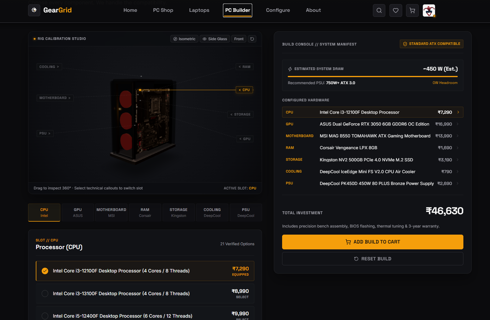
</p>

---

## GEARGRID CONFIGURE

**GearGrid Configure is the platform's standout feature** — a guided, server-side recommendation engine that replaces trial-and-error part picking with a five-question consultation and returns three complete, physically compatible, budget-aware systems, generated live from whatever is actually in stock in MongoDB at request time.

<p align="center">
  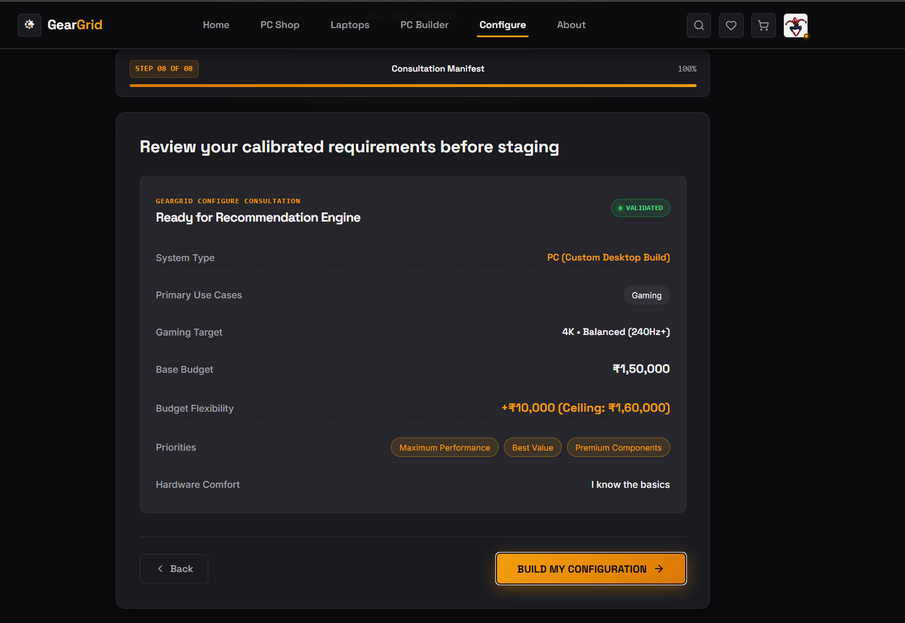
</p>

Where **PC Builder** is manual component-by-component assembly, **Configure** is an intelligence layer: it takes *what you want to do with the machine* — not *which parts you want* — and does the selection, compatibility checking, and budget balancing for you.

<p align="center">
  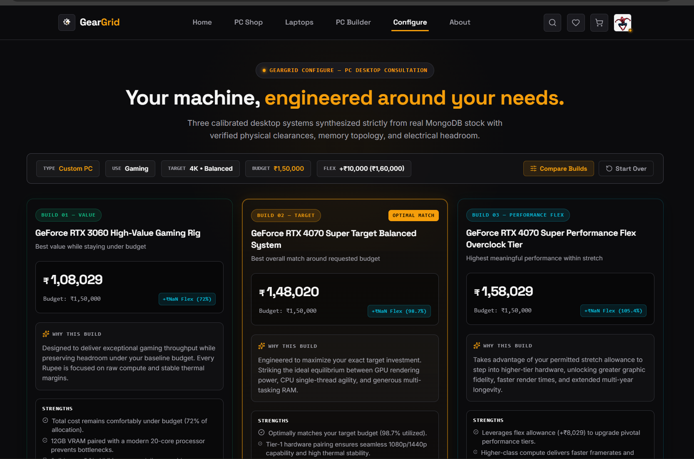
</p>

## Configure: Technical Flow

```
User
 │  chooses PC or Laptop (systemType)
 │  answers primary use-case(s) — Gaming, Editing, Rendering,
 │  Programming, AI/ML, Professional, Streaming (+ resolution
 │  detail for gaming)
 │  sets budget + optional flex allowance + priorities
 ▼
React (ConfigurePage.jsx) — assembles the questionnaire payload
 ▼
configureAPI.getRecommendations()  →  POST /api/v1/configure/recommend
 ▼
Express route → configure.routes.js
 ▼
Controller → generateRecommendations()  (configure.controllers.js)
 │
 ├─ 1. Request validation
 │     • systemType branches to PC or laptop pipeline
 │     • budget must be a valid number ≥ ₹35,000 (400 if not)
 │     • useCases / workloads / priorities normalized from body
 │
 ├─ 2. Load real MongoDB products
 │     • Product.find(...).populate("category").lean()
 │     • grouped into 8 component buckets: CPU, GPU, Motherboard,
 │       RAM, Storage, Cooling, Case, PSU (desktop mode)
 │       — or the laptop catalog (laptop mode)
 │
 ├─ 3. Compatibility filtering (checkCompatibility)
 │     • CPU socket ↔ Motherboard socket
 │     • Motherboard memory type ↔ RAM memory type
 │     • Motherboard form factor ↔ Case form-factor support
 │     • GPU length ↔ Case GPU clearance
 │     • Cooler socket support + max TDP ↔ CPU TDP
 │     • PSU wattage ↔ estimated peak system draw (with 15% headroom)
 │
 ├─ 4. Use-case scoring (scoreComponent / computeWorkloadWeights)
 │     • Blended CPU/GPU/RAM/Storage weight vector per selected
 │       use-case (e.g. Gaming skews GPU-heavy, Programming skews
 │       CPU + RAM heavy, AI/ML skews GPU + RAM heavy)
 │     • Gaming resolution (1080p/1440p/4K/6-8K) further reweights
 │       CPU vs GPU emphasis
 │     • Each candidate component is scored against that vector
 │
 └─ 5. Budget optimization (selectThreeBuilds)
       • filters every fully-compatible build combination to
         those at or under budget
       • ranks by score-to-price efficiency and by raw score
       • selects a flex-tier build that may exceed budget up to
         budget + budgetFlex, if the user allowed a flex allowance
 ▼
3 recommendations returned, each with full component list,
compatibility check breakdown, and a plain-language explanation
 ▼
React renders the results — Value / Target / Performance Flex
```

### The Three Recommendations

| Tier | Selection Logic | Positioning |
|---|---|---|
| **Value** | Chosen from builds landing roughly 72–92% of the stated budget, ranked by **score ÷ price** (efficiency) rather than raw performance | Maximum performance-per-Rupee, with comfortable headroom under budget |
| **Target** | The highest raw-score build that still lands at or under the full budget, distinct from the Value pick | The best system the exact stated budget can buy, fully spent |
| **Performance Flex** | Allowed to exceed the base budget, up to `budget + budgetFlex`, ranked by raw score | Uses the user's explicitly permitted stretch allowance to unlock a materially stronger tier of hardware |

Every recommendation ships with a `compatibility.checks[]` array (per-pair verification like *"AM5 matches AM5 socket architecture"* or *"850W PSU exceeds recommended 750W (est. peak 612W)"*), a generated `whyThisBuild` explanation, a list of `strengths`/`tradeoffs`, and a `budgetUsedPercent` so the user can see exactly how the recommendation was reasoned about — not just what it is.

Requests are validated with a hard floor of ₹35,000 and will return a `422` with a specific, actionable message if the current catalog genuinely cannot assemble a compatible 8-component system within budget (rather than silently returning an incompatible or incomplete build).

---

## Cart, Wishlist, Checkout & Orders

- **Cart** — one `Cart` document per user (`GET/POST/PATCH/DELETE /api/v1/cart`), storing `{ product, quantity }` line items. Quantity updates and single-item/full-cart removal are both supported.
- **Wishlist** — one `Wishlist` document per user, product IDs deduplicated via Mongoose's `addToSet` so a product can't be added twice.
- **Order placement** (`POST /api/v1/orders`) reads the user's current cart, verifies every referenced product still exists, snapshots each item's `name`/`image`/`price`/`quantity` at time of purchase (so later price or catalog changes don't retroactively alter a historical order), computes `totalAmount`, creates the `Order`, and **empties the cart** in the same request.
- **Order history** — `GET /api/v1/orders` (all of the current user's orders) and `GET /api/v1/orders/:orderId` (single order, scoped to the requesting user).
- **Payments** — `POST /api/v1/payments` creates a `Payment` record against a given order and method (`UPI`/`CARD`/`NET_BANKING`), blocking duplicate initiation while a prior payment on that order is still `Pending`, `Success`, or `Refunded`.

## User Profile

Authenticated users can view (`GET /api/v1/auth/current-user`) and update (`PATCH /api/v1/auth/profile`) `fullName`, `phone`, `address`, `city`, `state`, `postalCode`, and `country` through a whitelisted field update — security-sensitive fields (`role`, `email`, `password`, `isEmailVerified`, `refreshToken`) are never touched by this endpoint regardless of request body contents. Avatar images are uploaded through the same Multer → Cloudinary pipeline used for products.

## Admin Console & CRUD

The admin console (`/admin`, gated by `AdminRoute` on the frontend and `isAdmin` middleware on the backend) provides:
- **Product management** — create, update, and delete products, including image upload/replacement through Multer + Cloudinary
- **Category management** — create categories (auto-slugged via `slugify`, duplicate-name/slug protected)
- Every admin mutation runs through the same `verifyJWT` → `isAdmin` → `express-validator` chain as the rest of the API — there is no separate, less-guarded admin API surface.

## Search, Filtering, Sorting & Pagination

Implemented server-side on `GET /api/v1/products` (see [Product / PC Shop Architecture](#product--pc-shop-architecture)): regex text search, category-alias resolution, brand match, price range, featured flag, four sort modes, and page/limit-based pagination with total-count metadata returned alongside results.

## Responsive Design

The frontend ships hand-written, component-scoped CSS per page (no CSS framework), designed mobile-first across the storefront, builder tools, and admin console, so the catalog, Configure questionnaire, and cart/checkout flows remain usable from small viewports up through desktop.

## SEO, Custom 404 & Web Quality

- **Structured metadata** — `index.html` ships full Open Graph and Twitter Card tags, a canonical URL, and JSON-LD `Organization`/`WebSite` structured data (including a `SearchAction` pointing at the shop's search query parameter).
- **Per-page SEO control** — a reusable `SEO` component lets individual pages override `title`/`description` and opt into `noindex`.
- **Custom 404** — a dedicated `NotFoundPage` (marked `noindex`) with clear navigation back to the home page or shop, rather than a framework default error screen.
- **Client-side routing on a static host** — `vercel.json` rewrites all paths to `index.html`, so deep-linked SPA routes resolve correctly on Vercel rather than 404ing at the CDN edge.

---

## API Documentation

Base URL: `/api/v1`

### Auth — `/auth`
| Method | Endpoint | Auth | Description |
|---|---|---|---|
| POST | `/register` | — | Register user, sends email verification OTP |
| POST | `/verify-email-otp` (alias `/verify-otp`) | — | Verify 6-digit email OTP, issues tokens |
| POST | `/resend-email-verification` (alias `/resend-otp`) | — | Resend verification OTP (60s cooldown) |
| POST | `/login` | — | Authenticate, issues access/refresh tokens |
| POST | `/logout` | ✔ | Clears refresh token + cookies |
| GET / POST | `/current-user` | ✔ | Fetch the authenticated user |
| PATCH | `/profile` | ✔ | Update profile fields + avatar upload |
| POST | `/refresh-token` | — (cookie/body) | Rotates access + refresh tokens |
| POST | `/forgot-password` | — | Sends password-reset OTP |
| POST | `/verify-reset-otp` | — | Verifies reset OTP before allowing reset |
| POST | `/reset-password` | — | Resets password with verified OTP |
| POST | `/change-password` | ✔ | Changes password for logged-in user |

### Products — `/products`
| Method | Endpoint | Auth | Description |
|---|---|---|---|
| GET | `/` | — | List products (search/filter/sort/paginate) |
| POST | `/` | Admin | Create product with image upload |
| GET | `/:productId` | — | Get single product |
| PUT | `/:productId` | Admin | Update product (+ optional image) |
| DELETE | `/:productId` | Admin | Delete product |

### Categories — `/categories`
| Method | Endpoint | Auth | Description |
|---|---|---|---|
| GET | `/` | — | List all categories |
| POST | `/` | Admin | Create a category |

### Cart — `/cart` (all routes require auth)
| Method | Endpoint | Description |
|---|---|---|
| GET | `/` | Get current user's cart |
| POST | `/` | Add item to cart |
| PATCH | `/:productId` | Update item quantity |
| DELETE | `/:productId` | Remove one item |
| DELETE | `/` | Clear entire cart |

### Wishlist — `/wishlist` (all routes require auth)
| Method | Endpoint | Description |
|---|---|---|
| GET | `/` | Get current user's wishlist |
| POST | `/:productId` | Add product to wishlist |
| DELETE | `/:productId` | Remove product from wishlist |

### Orders — `/orders` (all routes require auth)
| Method | Endpoint | Description |
|---|---|---|
| POST | `/` | Place an order from the current cart |
| GET | `/` | List current user's orders |
| GET | `/:orderId` | Get a single order |

### Payments — `/payments` (all routes require auth)
| Method | Endpoint | Description |
|---|---|---|
| POST | `/` | Create a payment record for an order |

### Configure — `/configure`
| Method | Endpoint | Auth | Description |
|---|---|---|---|
| POST | `/recommend` | — | Generate 3 compatible builds (PC or laptop) |

### Health — `/healthcheck`
| Method | Endpoint | Description |
|---|---|---|
| GET | `/` | Service liveness check |

All responses follow a consistent envelope: `{ statusCode, data, message, success }` on success, and `{ statusCode, success: false, message, errors }` on failure.

---

## Project Structure

```
GearGrid/
├── Backend/
│   ├── src/
│   │   ├── app.js                     # Express app, CORS, middleware, route mounting
│   │   ├── index.js                   # Entry point — env, DB connect, listen
│   │   ├── db/index.js                # Mongoose connection
│   │   ├── routes/                    # auth, product, category, cart, wishlist,
│   │   │                              # orders, payments, configure, healthCheck
│   │   ├── controllers/                # Business logic per resource
│   │   ├── models/                     # User, Product, Category, Cart, Wishlist,
│   │   │                              # Order, Payment
│   │   ├── middlewares/                # verifyJWT, isAdmin, multer, validator bridge
│   │   ├── validators/                 # express-validator rule sets
│   │   └── utils/                      # ApiResponse, ApiError, cloudinary, mails,
│   │                                  # asyncHandler, constants
│   └── package.json
│
├── Frontend/
│   ├── src/
│   │   ├── App.jsx                     # Route definitions
│   │   ├── main.jsx                    # React root
│   │   ├── context/ShopContext.jsx     # Global state (auth, cart, wishlist, UI)
│   │   ├── services/                   # Axios instance + one client per resource
│   │   ├── pages/                      # One page + stylesheet per route
│   │   ├── components/
│   │   │   ├── common/                 # Shared UI, route guards, SEO, ScrollToTop
│   │   │   ├── home/                   # Landing page sections
│   │   │   ├── shop/                   # Product grid, filters, cards
│   │   │   └── builder/                # PC Builder UI
│   │   └── styles/                     # Global theme + base styles
│   ├── index.html                      # SEO meta, structured data, fonts
│   └── vercel.json                     # SPA rewrite rule
│
└── README.md
```

## Environment Variables

Names only — no values are committed or published here.

**Backend (`Backend/.env`)**
```
PORT
MONGO_URI
CLIENT_URL
CORS_ORIGIN
ACCESS_TOKEN_SECRET
ACCESS_TOKEN_EXPIRY
REFRESH_TOKEN_SECRET
REFRESH_TOKEN_EXPIRY
CLOUDINARY_CLOUD_NAME
CLOUDINARY_API_KEY
CLOUDINARY_API_SECRET
RESEND_API_KEY
MAIL_FROM
```

**Frontend (`Frontend/.env`)**
```
VITE_API_URL
```

## Installation

**Prerequisites:** Node.js, npm, and a MongoDB connection string (local or Atlas).

```bash
# 1. Clone the repository
git clone https://github.com/AadityaHaswani/GearGrid.git
cd GearGrid

# 2. Install backend dependencies
cd Backend
npm install

# 3. Install frontend dependencies
cd ../Frontend
npm install
```

Create a `.env` file in `Backend/` and `Frontend/` populated with the variable names listed above, using your own MongoDB, Cloudinary, and Resend credentials.

## Running Locally

```bash
# Terminal 1 — Backend (from /Backend)
npm run dev
# Starts on http://localhost:<PORT> via nodemon

# Terminal 2 — Frontend (from /Frontend)
npm run dev
# Starts the Vite dev server (default http://localhost:5173)
```

Set `VITE_API_URL` in `Frontend/.env` to your backend's `/api/v1` base (e.g. `http://localhost:8000/api/v1`) so the frontend's Axios client targets it correctly.

Optional backend script:
```bash
npm run seed
# Runs Backend/src/seed.js to populate the product catalog
```

## Deployment

- **Frontend** is deployed to **Vercel** as a static Vite build, with `vercel.json` rewriting all routes to `index.html` so client-side routes resolve correctly.
- **Backend** is a standard Node/Express process reading all configuration from environment variables, deployable to any Node-compatible host (targeting **Render**). `npm start` runs `node src/index.js` against a production `MONGO_URI`.
- Set `CLIENT_URL` on the backend to your deployed frontend origin so CORS accepts requests from it; any `*.vercel.app` origin is already permitted automatically for preview deployments.

## Production Configuration

- **CORS** dynamically resolves allowed origins from `CLIENT_URL`/`CORS_ORIGIN`, plus a permissive regex for any `*.vercel.app` subdomain — covering both the production domain and every Vercel preview URL without manual updates.
- **Cookies** are issued with `secure: true` and `sameSite: "strict"`, appropriate for a cross-origin HTTPS deployment (Vercel frontend ↔ Render backend).
- **Body size limits** are capped at 16kb for JSON/urlencoded payloads to reduce abuse surface on the API.
- **File size limits** are enforced at the Multer layer (5MB) before any request reaches Cloudinary.

## Challenges & Solutions

**Modeling one product schema for two very different hardware categories.** Desktop components (CPU, GPU, motherboard...) and laptops have almost entirely different meaningful specification fields. Rather than maintaining parallel `Product` and `Laptop` collections, GearGrid uses a single flexible `specifications` sub-schema (`strict: false`) that holds both desktop-component fields and laptop-specific fields side by side, discriminated at the application layer by `productType`. This keeps the Configure engine, the shop filters, and the admin CRUD forms working against one consistent collection.

**Making Configure's recommendations trustworthy, not just plausible.** A recommendation engine that silently swaps in an incompatible part (wrong socket, underpowered PSU) erodes trust immediately. `checkCompatibility()` runs six explicit pairwise checks — socket, memory type, form factor, GPU clearance, cooler thermal envelope, and power delivery headroom — against every candidate build, and every build in the final response carries its full checklist, not just a pass/fail flag.

**Producing three *meaningfully different* builds, not three near-duplicates.** `selectThreeBuilds()** deliberately targets different regions of the price/performance space per tier (Value: 72–92% of budget, ranked by efficiency; Target: highest score at or under budget; Performance Flex: above budget up to the flex ceiling, ranked by raw score) and actively de-duplicates the three selections, falling back through several candidate pools so the user isn't shown the same system three times under different labels.

**Auth that works with or without cookies.** Since the frontend is deployed separately from the API (Vercel + a Node host), `verifyJWT` accepts either the `httpOnly` cookie or a `Bearer` header, and the Axios client stores a token in `localStorage` as a fallback — covering environments/clients where third-party cookies are restricted.

## Engineering Decisions

- **Context API over Redux** — the app's shared state (auth, cart, wishlist, UI drawers) is cohesive enough to live in one provider without needing action/reducer boilerplate.
- **Deterministic, explainable scoring over a black-box model** — Configure's weighting and scoring functions are plain, inspectable JavaScript (`BASE_USECASE_WEIGHTS`, `scoreComponent`, `checkCompatibility`) rather than an opaque ML model, so every recommendation can be explained and reproduced from the same inputs.
- **Snapshotting order line items** — `Order.items` stores `name`/`image`/`price` at time of purchase rather than only a `Product` reference, so historical orders remain accurate even if a product is later repriced, renamed, or removed.
- **Category aliasing at the query layer** — a single alias map lets the frontend pass loose category labels (`gpu`, `graphics`, `graphics-card`...) without the frontend needing to know the canonical slug, keeping the UI layer decoupled from exact catalog taxonomy.
- **Separate OTP flows for verification vs. reset** — sharing the hashing/expiry mechanism but keeping the fields (`emailVerificationOtp` vs `forgotPasswordOtp`) and endpoints fully separate, so a leaked or expired code in one flow can never be replayed against the other.

## Testing

The project has been validated through manual, scenario-driven QA across the authentication lifecycle, cart/wishlist/order flows, admin CRUD, and the Configure engine (including edge cases like insufficient budget and empty catalog categories, both of which return explicit `4xx` errors rather than failing silently). There is currently no automated test suite (unit/integration) in the repository — this is called out explicitly in [Future Scope](#future-scope) rather than glossed over.

---

## Screenshots

### Home
<p align="center">
  
  
  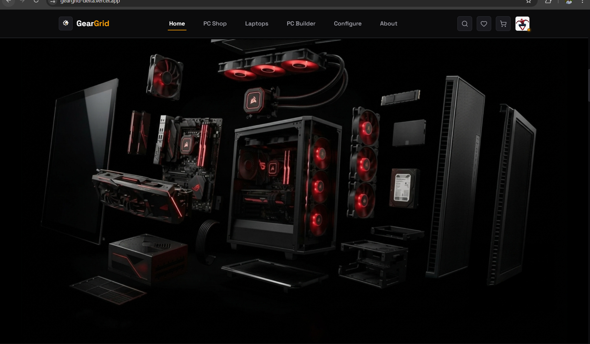
</p>
<p align="center">
  
  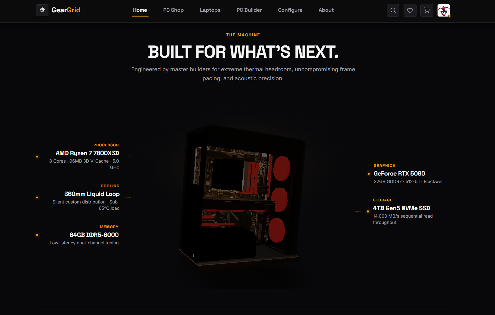
  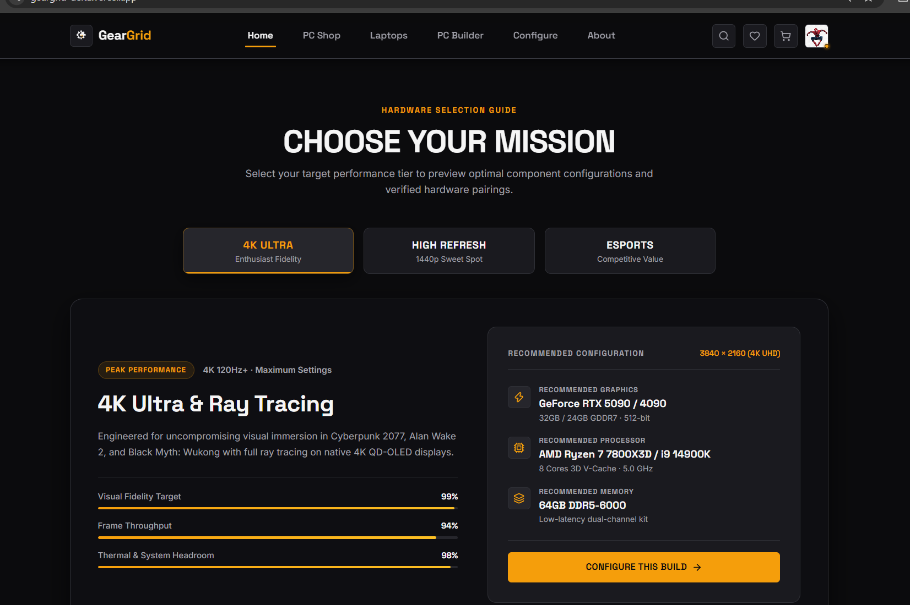
</p>

### PC Shop & Laptops
<p align="center">
  
  
  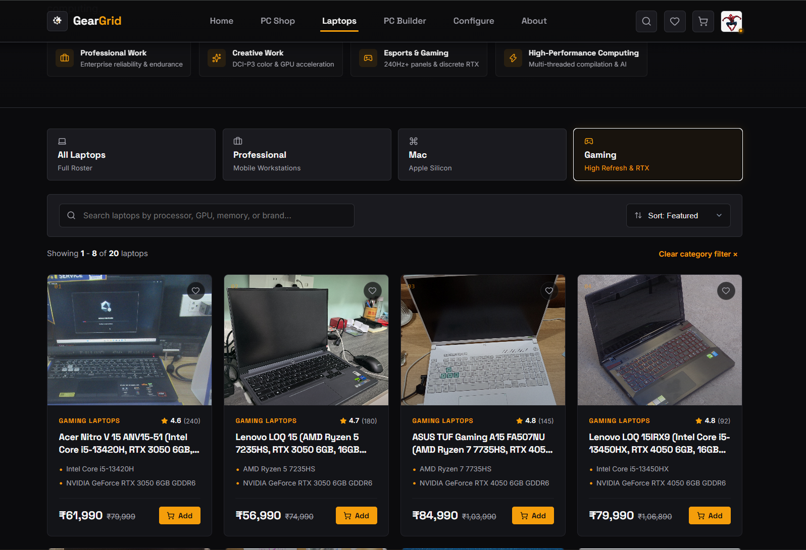
</p>

### PC Builder & GearGrid Configure
<p align="center">
  
  
  
</p>

### About
<p align="center">
  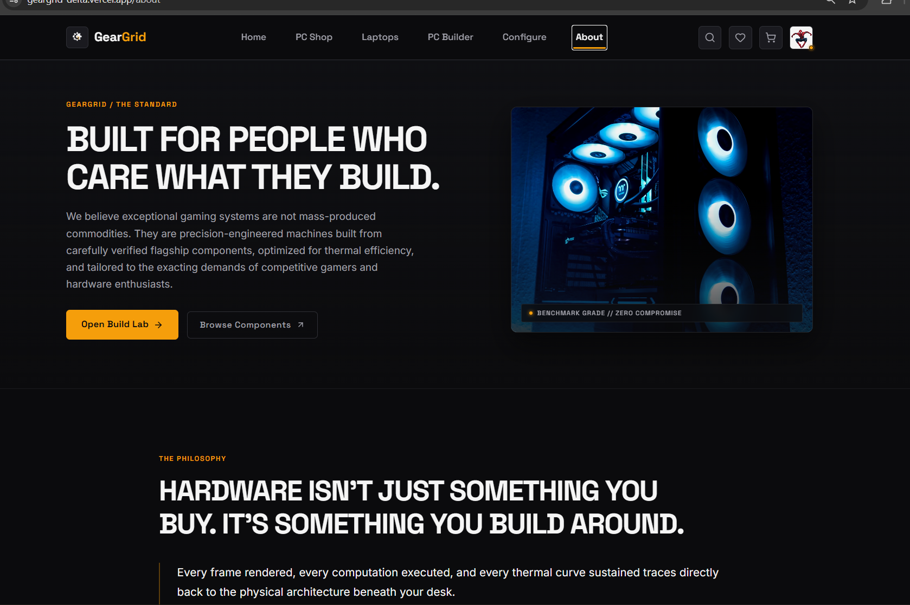
  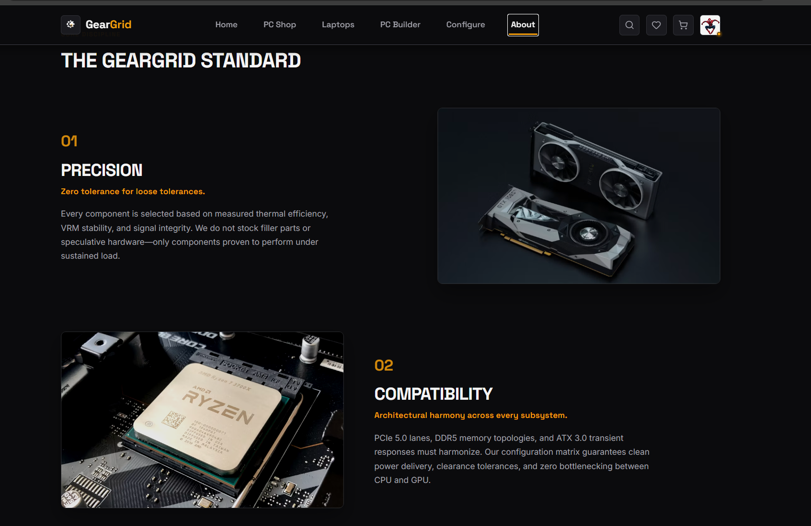
</p>

### Search, Wishlist & Cart
<p align="center">
  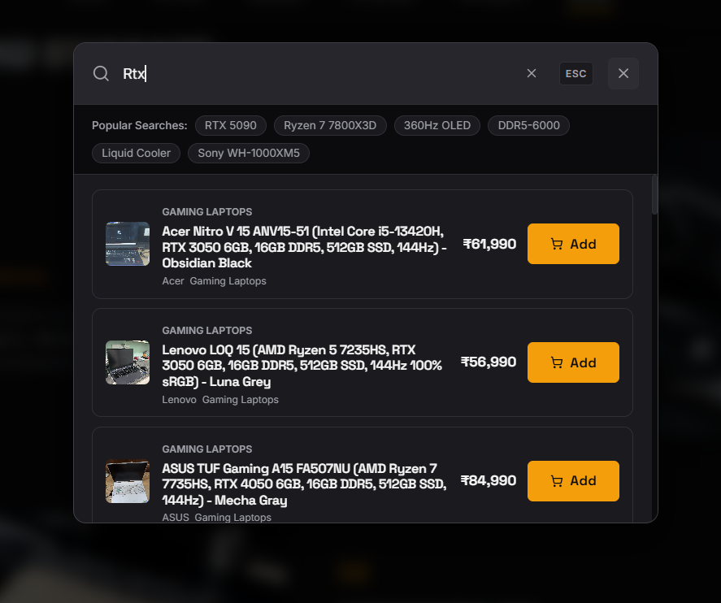
  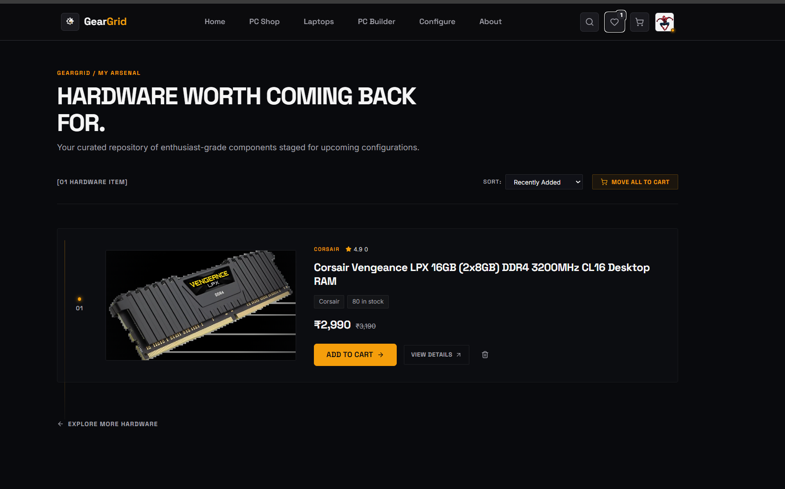
  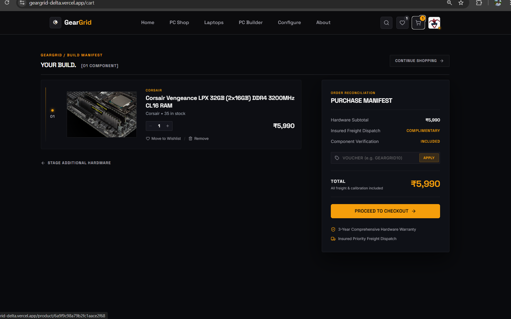
</p>

### Profile & Authentication
<p align="center">
  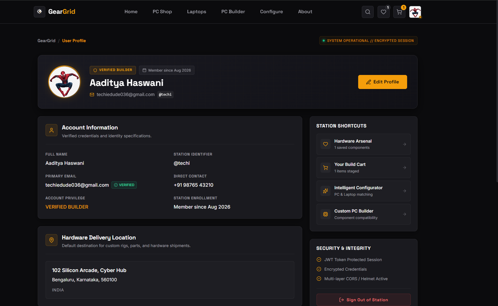
  
  
</p>

### Product Details
<p align="center">
  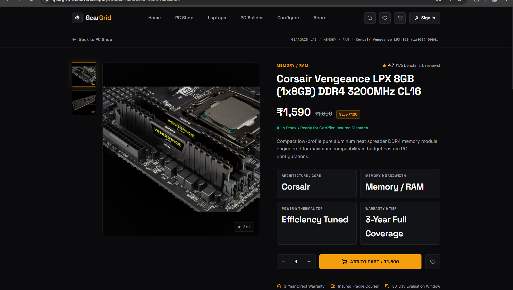
  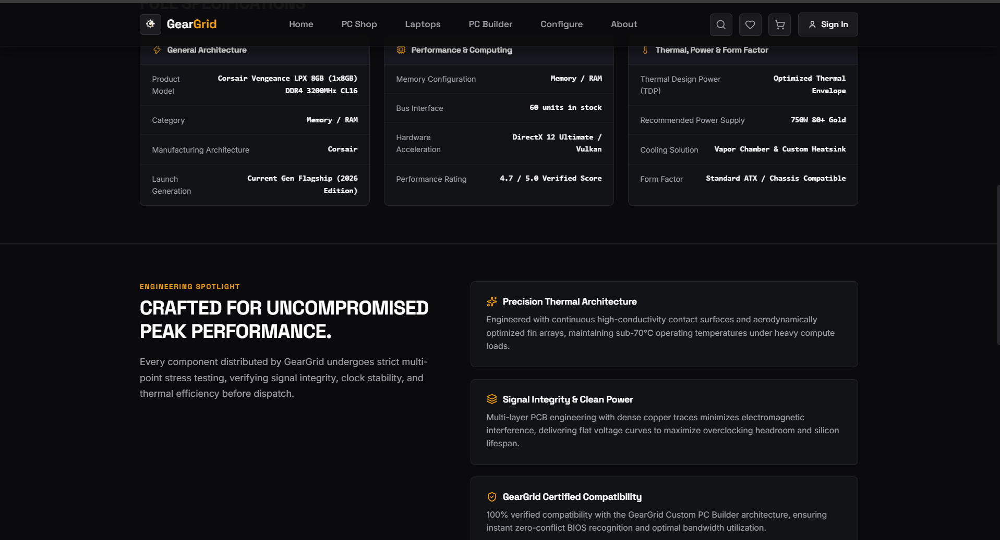
</p>

### Admin Console
<p align="center">
  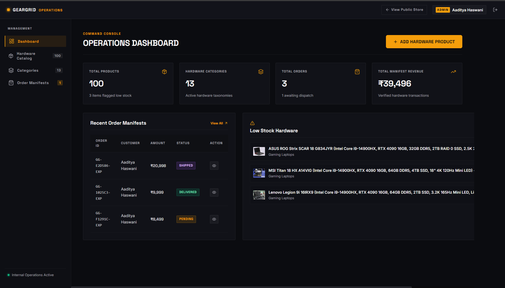
  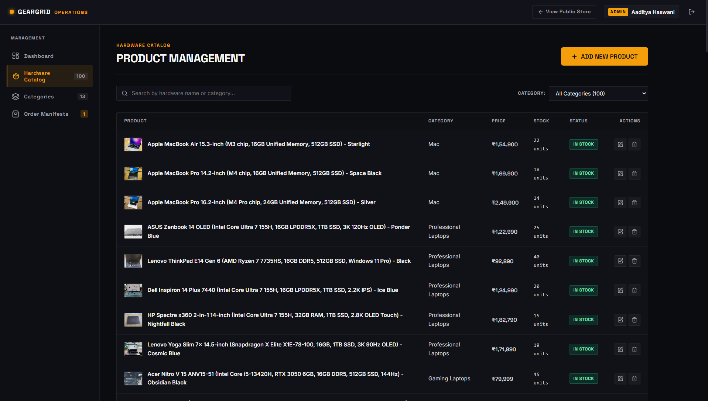
</p>
<p align="center">
  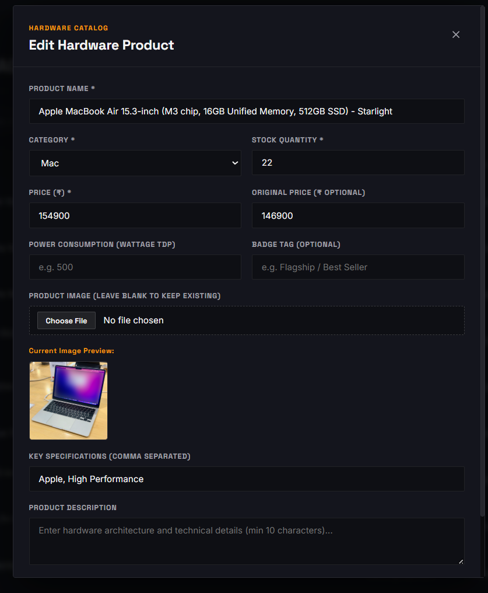
  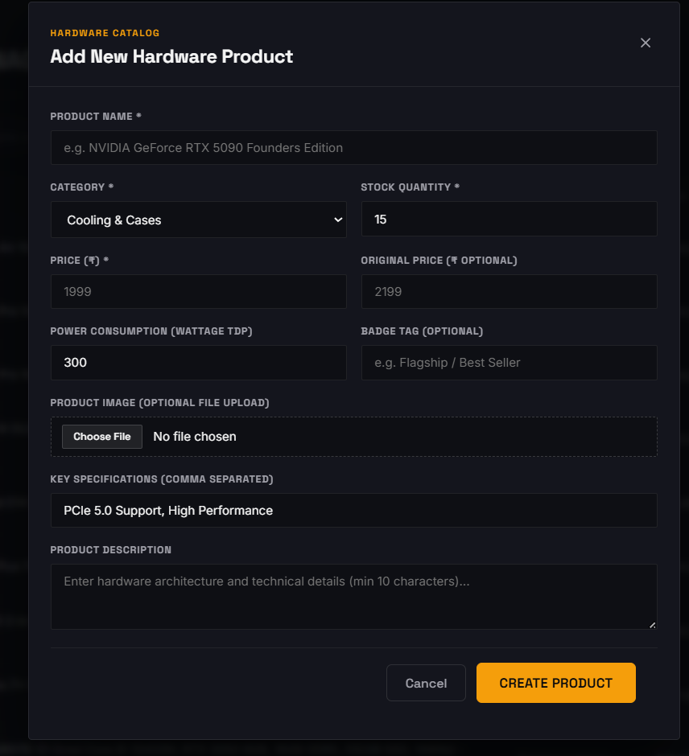
</p>

---

## Future Scope

- Automated test coverage (unit tests for scoring/compatibility logic, integration tests for the API surface)
- Live payment gateway integration (the `Payment` model already reserves `gatewayOrderId`/`gatewayPaymentId`/`gatewaySignature` fields for this)
- Product reviews and ratings input (the schema tracks `rating`/`numReviews`, but there's no current endpoint for submitting a review)
- Order status transitions surfaced to admins (status field exists on `Order`; an admin-facing order management view is a natural next step)
- Saved/named Configure builds, so a generated recommendation can be revisited or shared later
- Expanded compatibility checks in Configure (e.g. RAM slot count vs. module count, PCIe lane budgeting for multi-GPU/AIC combinations)

## Learning Outcomes

Building GearGrid end-to-end covered:
- Designing a single flexible schema that serves two structurally different product categories without duplicating collections
- Building a deterministic, explainable recommendation/scoring engine from first principles, rather than reaching for an off-the-shelf ML solution
- Implementing a complete, secure JWT access/refresh rotation flow alongside a from-scratch hashed-OTP verification system
- Structuring a layered Express API (routes → validators → middleware → controllers → models) that stays consistent as the surface area grows
- Coordinating a decoupled frontend/backend deployment (Vercel + a separate Node host) including the CORS, cookie, and SPA-routing details that only surface in a real cross-origin production environment

## Team / Contributors

Built and maintained by **Aaditya Haswani**.

## License

This repository does not currently include a `LICENSE` file. All rights are reserved by the author unless a license is added to the repository.
